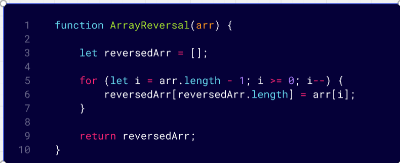
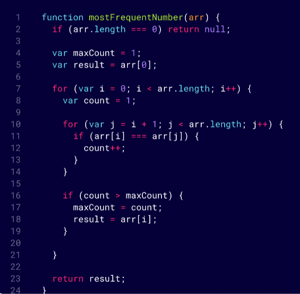

# Whiteboard Challenges

## Challenge (1)

### Reversed array challenge

This function takes an array and returns the reverse of it.

### Most Frequent Number challenge

This function takes an array and returns the most frequent number.

-------

## Challenge (2)

### Minimum Value

This function takes an array and returns the minimum value.

### Challenge 03: Reverse Characters  
[Reverse-Characters](Challenges/Reverse-Characters/README.md)

### Challenge 04: Remove Middle index
[Remove-Middle-Index](Challenges/Remove-Middle/README.md)

### Challenge 05: Linked Lists
[Linked-Lists](Data%20Structures/LinkedList/README.md)
